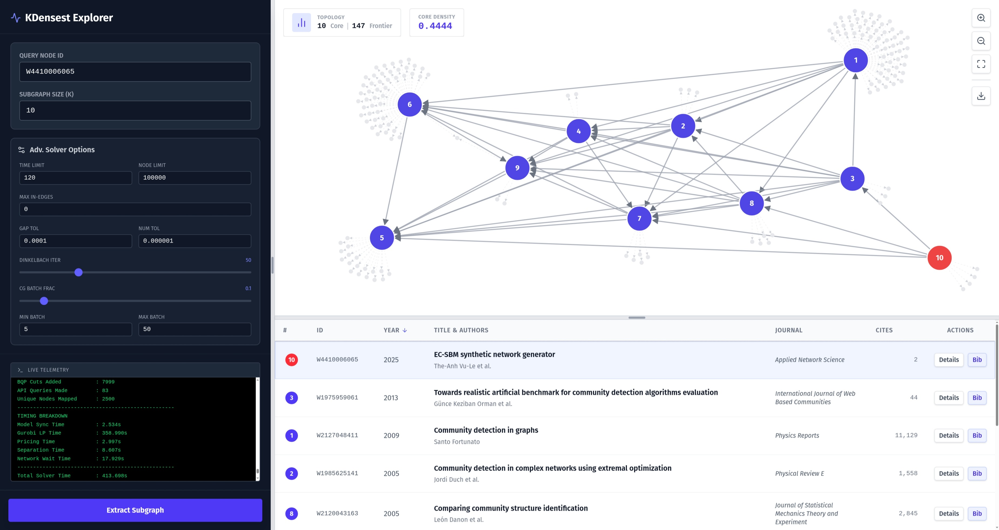

## Densest Community Search



This repository implements query-anchored dense community search on directed
citation graphs.  The core solver asks for a query-containing set of at least
`k` papers that maximizes induced directed pair density, with an optional
rooted edge-connectivity threshold.  The repo also includes local and OpenAlex
oracles, a browser UI, and experiment scripts for the Cora-ML and brute-force
correctness studies described in `docs/paper/manuscript.tex`.

## Repository Layout

```text
.
|-- solver/                  C++17 solver, CMake build, CLI entry point
|   |-- src/                 BP solver, baselines, oracles, quality metrics
|   |-- build.sh             one-shot build script
|   `-- bin/solver           generated binary after build
|-- backend/server.py        FastAPI wrapper around the solver binary
|-- frontend/                React + Vite + D3 web UI
|-- scripts/_solver_runner.py
|                            Python solver invocation and JSON parsing
|-- scripts/classification/  CitationFull-style data prep, sweeps, aggregators
|-- scripts/synthetic/       brute-force correctness experiment helpers
|-- data/                    prepared input datasets and split metadata
|-- exps/                    experiment outputs and generated aggregate files
`-- docs/
    |-- paper/               manuscript source and references
    |-- slides/              research slides
    `-- imgs/                README images
```

Do not write experiment results into `data/`; use `exps/`.

## Solver Overview

For a directed graph `G=(V,E)`, query node `q`, and minimum size `k`, the BP
solver searches for `S` with `q in S` and `|S| >= k` maximizing

```text
|E(S)| / (|S| * (|S| - 1)).
```

The implementation combines:

- Dinkelbach updates for the fractional density objective.
- Branch-and-price over an active set with lazy frontier promotion.
- Triangle cuts for the Boolean-quadric relaxation.
- Optional rooted edge-connectivity cuts controlled by `--kappa`.
- Incumbent pruning and optional live incumbent telemetry.

The baselines share the same oracle conventions:

- `--bfs`: depth-limited BFS neighborhood, optionally grown to `k`.
- `--avgdeg`: query-anchored average-degree optimum, optionally grown to `k`.

## Build and Runtime Requirements

The solver build requires Gurobi, libcurl, Boost, and CMake.  `nlohmann/json`
is downloaded into the CMake build directory on first build.

```bash
export GUROBI_HOME=/path/to/gurobi/linux64
./solver/build.sh
```

Solver and experiment runs that use Gurobi need a valid license.  In this
environment:

```bash
GRB_LICENSE_FILE=/home/vltanh/gurobi.lic
```

Python experiment scripts are expected to run in the `dcs` conda environment,
which has the graph-analysis dependencies used by `solver_utils.py`
(`networkx`, `pymincut`, `scipy`, `sklearn`, `pandas`, and related packages).

## Solver CLI

Simulation mode uses a local edge CSV with `source,target` columns:

```bash
./solver/bin/solver --mode sim --input data/Cora_ML/edge.csv --query 0 --bp --k 3 --emit-json
```

OpenAlex mode uses live OpenAlex work IDs:

```bash
./solver/bin/solver --mode openalex --query W2741809807 --bp --k 5 --max-in-edges 0
```

Variant flags:

- `--bp`: branch-and-price. Requires `--k >= 2`; accepts `--kappa`.
- `--avgdeg`: average-degree baseline. Optional `--k` triggers grow-to-k.
- `--bfs`: BFS baseline. Uses `--bfs-depth`; optional `--k` triggers grow-to-k.

Useful solver options:

- `--time-limit <seconds>`: BP no-improvement budget; `-1` disables.
- `--hard-time-limit <seconds>`: wall-time cap over the whole BP solve; `-1` disables.
- `--node-limit <int>`: BP branch-and-bound node cap; `-1` disables.
- `--gap-tol <float>`: BP relative gap tolerance; `-1` disables.
- `--dinkelbach-iter <int>`: Dinkelbach iteration cap; `-1` disables.
- `--cg-batch-frac <float>`, `--cg-min-batch <int>`, `--cg-max-batch <int>`: column-generation batch controls.
- `--max-in-edges <int>`: incoming-edge cap for both local and OpenAlex oracles. The paper experiments use `0`.
- `--gurobi-seed <int>`: Gurobi random seed.
- `--no-materialize`: BP-only switch that skips extra frontier materialization.
- `--compute-qualities`: compute post-solve quality metrics. This can issue extra oracle queries.
- `--emit-json`: print one `JSON_RESULT:<payload>` line.
- `--json-output <path>`: write the JSON payload to a file.
- `--stream-incumbents`: emit `INCUMBENT_JSON:<payload>` lines when BP improves the incumbent.

The Python wrappers treat missing JSON or a nonzero solver exit as a hard
failure, so stale binaries and license failures do not silently create empty
experiment records.

## Web UI

The browser UI supports both OpenAlex and local simulation datasets.  It can run
BP, AvgDeg, or BFS through the backend, stream solver logs, display live BP
incumbent telemetry, show post-solve quality metrics, render the returned graph
with D3, and fetch OpenAlex metadata/BibTeX.

Install and run:

```bash
./solver/build.sh
python backend/server.py

cd frontend
npm install
npm run dev
```

Open the Vite URL, usually `http://localhost:5173`.  `VITE_API_URL` overrides
the backend URL used by the frontend build.

Backend endpoints:

| Method | Path | Description |
| --- | --- | --- |
| `POST` | `/api/extract` | Run the solver against OpenAlex and stream NDJSON packets. |
| `POST` | `/api/extract-sim` | Run the solver against `data/<dataset>/edge.csv`. |
| `POST` | `/api/stop?session_id=<id>` | Terminate the active solver subprocess. |
| `GET` | `/api/datasets` | List prepared local simulation datasets. |
| `GET` | `/api/bibtex?doi=<doi>` | Fetch BibTeX through DOI content negotiation. |

The stream protocol uses `{type:"log"}`, `{type:"incumbent"}`,
`{type:"qualities"}`, `{type:"meta"}`, `{type:"result"}`, and `{type:"error"}`
packets.  Keep `backend/server.py`, `frontend/src/hooks/useSubgraphExtractor.js`,
and `solver/src/main.cpp` aligned when changing this contract.

## Paper Experiment Framing

The manuscript in `docs/paper/` organizes the evaluation around three questions:

1. Does BP match brute-force optima on small fully enumerable graphs?
2. On Cora-ML, what intrinsic community geometry and cost does BP return
   compared with BFS and AvgDeg?
3. How much label information do the returned communities preserve under a
   simple majority-vote classifier?

The codebase currently implements those workflows with the scripts below.  Some
historical numbers in the paper draft may reflect an earlier split definition;
current experiment runs should be interpreted through `data/<dataset>/split_meta.json`.

## Brute-Force Correctness Experiment

The active synthetic correctness workflow is in
`scripts/synthetic/bruteforce_verify.py`.  It samples small undirected
Erdos-Renyi graphs, converts each undirected edge to reciprocal directed arcs,
enumerates query-containing optima, runs the solver, and compares objective
values.

Example small grid:

```bash
conda run -n dcs python scripts/synthetic/bruteforce_verify.py bf_generate \
  --n 20 --p-values 0.25,0.50,0.75 --seed-start 0 --num-seeds 5

conda run -n dcs python scripts/synthetic/bruteforce_verify.py bf_optima \
  --n 20 --k-values 3,4,5 --kappa-values 0,1,2 --max-workers 4

GRB_LICENSE_FILE=/home/vltanh/gurobi.lic conda run -n dcs python scripts/synthetic/bruteforce_verify.py bf_solver_runs \
  --n 20 --k-values 3,4,5 --kappa-values 0,1,2 --gurobi-seed 42 --time-limit -1 --max-workers 4

conda run -n dcs python scripts/synthetic/bf_summarize.py \
  --solver-runs exps/synthetic/bf/solver_runs.csv \
  --output exps/synthetic/bf/summary.csv
```

The unit test `scripts/synthetic/test_brute_force_optima.py` covers the
brute-force enumerator.

## Cora-ML Classification and Quality Experiments

The active classification pipeline uses CitationFull-style CSVs:

- `data/<dataset>/edge.csv`: directed edges with `source,target`.
- `data/<dataset>/nodes.csv`: `node_id,label,train,val,test`.
- `data/<dataset>/split_meta.json`: hashes for edges, splits, query pool, and hard subset.

Prepare or regenerate masks:

```bash
conda run -n dcs python scripts/classification/prepare_data.py --dataset Cora_ML --source existing
```

`--source citationfull` downloads through PyTorch Geometric when available.
`--source existing` reuses the checked-in `edge.csv` and labels in `nodes.csv`
and rewrites the masks plus `split_meta.json`.

Current split semantics in code:

- candidate queries are pure sources,
- out-degree is at least 2,
- out-reachable size is at least 5,
- the query participates in at least one undirected triangle,
- validation and test are label-stratified 50/50 under seed 42.

For the checked-in Cora_ML export at the time of this README, `split_meta.json`
records 2,995 nodes, 8,416 directed edges, a 504-node query pool, 252 validation
queries, 252 test queries, 2,491 training nodes, and a 29-node BFS-depth-1-wrong
hard subset.

Run the paper-style Cora_ML sweep:

```bash
GRB_LICENSE_FILE=/home/vltanh/gurobi.lic conda run -n dcs python scripts/classification/sweep_cluster_quality.py \
  --dataset Cora_ML \
  --family all \
  --bp-k 3,4,5 \
  --bp-kappa 0,1,2 \
  --bfs-depth 1 \
  --seeds 42 \
  --solver-time-limit 60 \
  --hard-time-limit 300 \
  --max-workers 8
```

This writes resumable per-query records under:

```text
exps/classification/Cora_ML/cluster_quality/<method>/<params_hash>/records.ndjson
```

Rerunning the same command resumes from complete cached records.  Deterministic
methods store one record per query; BP records are keyed by query, params hash,
dataset, split hash, and Gurobi seed.  The aggregators reject stale split hashes
and incomplete cells by default.  Use `--allow-partial` only for interim
inspection while a long sweep is still running.

Create broad aggregate CSVs:

```bash
conda run -n dcs python scripts/classification/aggregate_experiment.py \
  --records exps/classification/Cora_ML/cluster_quality \
  --output exps/classification/Cora_ML/agg/wide \
  --dataset Cora_ML
```

Render LaTeX table snippets from those CSVs:

```bash
conda run -n dcs python scripts/classification/aggregate_to_latex.py \
  --aggregate-dir exps/classification/Cora_ML/agg/wide \
  --output docs/paper/generated_tables \
  --dataset Cora_ML
```

Specialized aggregators are also available:

- `aggregate_cluster_quality.py`: intrinsic quality summaries.
- `aggregate_cost.py`: wall time, oracle queries, LP/cut/search counters.
- `aggregate_classification.py`: validation-best classification tables.
- `paired_bootstrap_ties.py`: paired bootstrap table with tie markers.

## Testing

Use focused checks by surface:

```bash
./solver/build.sh
conda run -n dcs python -m py_compile scripts/classification/*.py scripts/synthetic/*.py scripts/*.py
conda run -n dcs python -m unittest scripts.test_solver_runner scripts.classification.test_solver_utils -v
conda run -n dcs python -m unittest scripts.synthetic.test_brute_force_optima -v

cd frontend
npm run lint
npm run build
```

The real-solver regression in `scripts.test_solver_runner` is skipped when the
solver binary, synthetic fixture, or `/home/vltanh/gurobi.lic` is unavailable.

## Development Notes

- Keep solver CLI changes synchronized across `solver/src/main.cpp`,
  `scripts/_solver_runner.py`, `backend/server.py`, and the frontend request
  shape in `useSubgraphExtractor.js`.
- Keep classification cache keys deterministic.  If a change affects records or
  quality metrics, update the effective params or quality schema version.
- Do not silently convert solver failures into empty communities.  Cached
  experiment records should represent successful solver JSON payloads.
- Do not commit generated `data/`, `exps/`, `solver/bin/`, `solver/build/`,
  `frontend/dist/`, `frontend/node_modules/`, or LaTeX auxiliary files unless a
  task explicitly asks for them.

Recent commits use short scoped summaries such as:

```text
solver: stream BP incumbent telemetry
scripts: harden solver record caching
scripts: restrict splits to triangle queries
```
