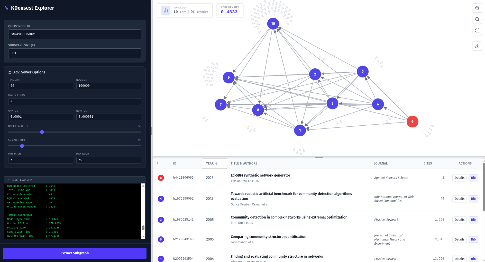

## Densest Community Search



This repository implements exact and heuristic solvers for the **K-Densest Subgraph** problem on directed graphs, along with a node classification application using the discovered dense communities as neighborhoods.

---

## Web GUI

An interactive browser-based explorer powered by the C++ solver and the OpenAlex live citation API, built with React, D3.js, and Tailwind CSS.

### Features

- Configure the query paper (OpenAlex ID), target community size *k*, and all advanced solver parameters from the sidebar.
- Live telemetry panel streams solver log output in real time so you can monitor convergence as it happens.
- Interactive D3 force-directed graph showing **core** nodes (numbered circles) and **frontier** ghost nodes (their immediate citation neighbourhood).
- Paper ledger table listing each core paper's title, authors, venue, year, and citation count.
- **Details** modal with the full abstract; **Bib** button fetches BibTeX via DOI.
- SVG export of the current graph viewport.
- Stop button terminates the solver mid-run; each browser tab gets its own independent session.
- Sidebar width and ledger height are continuously drag-resizable; double-click either divider to collapse or restore it.

### Setup

**1. Build the C++ solver** (see [C++ Solver](#c-solver) below for prerequisites):

```bash
bash build.sh
```

**2. Install backend dependencies:**

```bash
pip install fastapi uvicorn httpx pydantic
```

**3. Install frontend dependencies** (Node ≥ 18 required):

```bash
cd kdensest-gui
npm install
```

### Running

Start the API server (must be running before the frontend):

```bash
python server.py
# Listening on http://0.0.0.0:8000
```

In a separate terminal, start the development server:

```bash
cd kdensest-gui
npm run dev
# Open http://localhost:5173
```

For a production build:

```bash
cd kdensest-gui
npm run build   # output in kdensest-gui/dist/
```

### API Endpoints

| Method | Path | Description |
|--------|------|-------------|
| `POST` | `/api/extract` | Run the solver; request body includes `session_id`, `query_node`, `k`, `max_in_edges`, and all solver tuning fields; streams NDJSON `log`/`result`/`error` packets |
| `POST` | `/api/stop?session_id=<id>` | Terminate the solver process for the given session |
| `GET` | `/api/bibtex?doi=<doi>` | Fetch BibTeX for a paper via its DOI |

The `VITE_API_URL` environment variable overrides the default backend address (`http://127.0.0.1:8000`) for the frontend build.

---

## C++ Solver

Source code lives in `src/` and is built with CMake. The executable is placed at `bin/solver`.

### Algorithm

Given a directed graph G = (V, E) and an integer k, the solver finds a subset S ⊆ V with |S| ≥ k that maximises the **edge density** d(S) = |E(S)| / (|S|·(|S|−1)), where E(S) are all directed edges with both endpoints in S.

The solver combines three nested algorithms:

**Dinkelbach's algorithm (outer loop)** — reduces the fractional-objective problem to a sequence of parametric subproblems. At each iteration t, given the current density estimate λₜ, it solves:

> maximise  |E(S)| − λₜ · |S|·(|S|−1)  subject to  |S| ≥ k

and updates λₜ₊₁ = d(Sₜ). Convergence is superlinear; the loop terminates when the parametric objective reaches zero.

**Branch-and-Price (middle loop)** — solves each parametric subproblem to integer optimality. The LP relaxation is solved at each B&B node via column generation. The B&B tree is explored depth-first with an early-exit gap tolerance.

Branching uses a domain-aware variable selection rule. Each fractional node v is classified by its *fractional internal degree* — the weighted sum of LP values of its neighbours in the current solution:
- **Hanging node** (internal degree < 2λ): likely to reduce density if included. The weakest such node is branched *zero-first* (exclusion explored first).
- **Core node** (internal degree ≥ 2λ): well-embedded in the current solution. The most-fractional such node is branched *one-first* (inclusion explored first).

When a B&B integer solution is found, a greedy node-removal pass is applied before accepting it as incumbent: nodes are removed one at a time (never the query node) as long as removal strictly improves the parametric objective, stopping at size k. This can tighten the incumbent and prune more of the remaining tree.

**Column generation (inner loop)** — instead of exposing all nodes to the LP at once, the solver maintains an *active set* and a *frontier*. At each CG iteration it solves the restricted master problem (RMP), then prices the frontier: a frontier node f enters the active set if its reduced cost

> rc(f) = deg_frac(f) − 2λ · Σ xᵥ − π

is positive, where deg_frac(f) is f's fractional degree into the current LP solution and π is the dual of the size constraint. Only the top-scoring batch of frontier nodes is added per round (controlled by `--cg-batch-frac`, `--cg-min-batch`, `--cg-max-batch`).

**BQP triangle cuts** — when the LP solution is fractional, the solver separates violated triangle inequalities on the product-linearisation variables:

> xᵤ + xᵥ + xw − wᵤᵥ − wᵥw − wᵤw ≤ 1

up to 20 cuts per round, tightening the LP bound before branching.

**Dynamic graph expansion** — nodes are fetched on demand from a pluggable oracle (local CSV or live OpenAlex API). Predecessor and successor lists are retrieved lazily as the active set grows, so the solver works on implicit graphs without loading the entire edge list into memory.

### Dependencies

- **Gurobi** — set the `GUROBI_HOME` environment variable to your Gurobi installation (e.g., `export GUROBI_HOME=/path/to/gurobi1301/linux64`).
- **libcurl** — required for the OpenAlex live-API mode.
- **nlohmann/json** — automatically downloaded by CMake during the first build.

### Build

```bash
bash build.sh
```

### Usage

The solver supports two operating modes selected with `--mode`.

**Simulation mode** (local CSV graph):

```bash
./bin/solver --mode sim --input <edge.csv> --query <node_id> --k <k> [--output <out.csv>]
```

**OpenAlex mode** (live citation API):

```bash
./bin/solver --mode openalex --query <openalex_work_id> --k <k> [--output <out.csv>]
```

Required arguments:

- `--mode <sim|openalex>`: Mode of operation.
- `--query <node_id>`: String ID of the target query node.
- `--k <int>`: Target subgraph size (k ≥ 2).
- `--input <edge.csv>`: Path to the edge list CSV (`source`, `target` columns) — required for `sim` mode.

Optional arguments:

- `--output <out.csv>`: Save resulting community node IDs to this file (`node_id` column).
- `--time-limit <float>`: Algorithmic time budget in seconds, excluding network I/O (default: `600.0`). The clock resets each time a new incumbent is found, so this controls *time without improvement* rather than total B&B time.
- `--node-limit <int>`: Max B&B nodes to explore per Dinkelbach iteration (default: `100000`).
- `--max-in-edges <int>`: Max incoming edges to fetch per node (default: `1500`). Applies to both `sim` and `openalex` modes.
- `--gap-tol <float>`: Early-stopping relative gap tolerance for B&B (default: `1e-4`).
- `--dinkelbach-iter <int>`: Max Dinkelbach iterations (default: `50`).
- `--cg-batch-frac <float>`: Fraction of the active-set size to add per pricing round (default: `0.1`).
- `--cg-min-batch <int>`: Minimum columns added per pricing round (default: `5`).
- `--cg-max-batch <int>`: Maximum columns added per pricing round (default: `50`).
- `--tol <float>`: Numerical tolerance for zero-checks (default: `1e-6`).
- `--help`, `-h`: Print the help menu and exit.

---

## Synthetic Graph Generation

### Generate a Graph

```bash
python scripts/generate_graph.py --out_dir <output_dir> [options]
```

- `--out_dir`: Directory to write output files (`edge.csv`, `gt_comm.csv`, `metadata.json`).
- `--n_nodes`: Total number of nodes (default: `1000000`).
- `--m_edges`: Barabási–Albert attachment parameter (default: `10`).
- `--n_community`: Size of the planted dense community (default: `20`).
- `--p_community`: Edge probability within the planted community (default: `0.8`).
- `--p_reciprocal`: Global probability of adding a reciprocal edge (2-cycle) (default: `0.001`).
- `--seed`: Random seed (default: `42`).

Output files:
- `edge.csv` — directed edge list with columns `source`, `target`.
- `gt_comm.csv` — ground truth community with column `node_id`.
- `metadata.json` — graph statistics and generation parameters.

### Evaluate Solver Against Ground Truth

```bash
python scripts/evaluate_solver.py --gt <gt_comm.csv> --pred <pred_comm.csv>
```

- `--gt`: Path to the ground truth community CSV (`gt_comm.csv`).
- `--pred`: Path to the predicted community CSV produced by the solver.

Reports precision, recall, F1, and Jaccard similarity.

---

## Node Classification (CitationFull Datasets)

Uses the K-Densest community around each query node as its neighborhood for label propagation (majority vote). The shared solver execution and voting logic lives in `scripts/classification/solver_utils.py`.

All scripts below live in `scripts/classification/` and should be run from the project root.

### 1. Prepare Data

Downloads a CitationFull dataset and exports edge and node split files to `data/<dataset>/`. The split is **temporal/inductive**: nodes that have been cited ("foundational" papers) form the training set, while purely-citing ("new") papers are evenly divided into validation and test sets.

```bash
python scripts/classification/prepare_data.py --dataset <dataset_name>
```

- `--dataset`: One of `Cora`, `Cora_ML`, `CiteSeer`, `DBLP`, or `PubMed` (default: `Cora_ML`).

Output files written to `data/<dataset>/`:
- `edge.csv` — directed edge list with columns `source`, `target`.
- `nodes.csv` — node metadata with columns `node_id`, `label`, `train`, `val`, `test`.

### 2. Tune Hyperparameters

Sweeps `k` over the validation split to find the best community size.

```bash
python scripts/classification/tune.py --dataset <dataset_name> --k_min <min_k> --k_max <max_k> --k_step <step_k> --optimize <metric> --weighting <weight_strategy>
```

- `--dataset`: Dataset name matching a prepared `data/<dataset>/` directory (default: `Cora`).
- `--k_min`: Minimum k to evaluate (default: `5`).
- `--k_max`: Maximum k to evaluate (default: `25`).
- `--k_step`: Step size for k sweep (default: `5`).
- `--optimize`: Metric to maximize when selecting the best k (`accuracy`, `f1`, `precision`, `recall`; default: `accuracy`).
- `--weighting`: Voting weight strategy (`uniform` or `distance`; default: `uniform`).
- `--bin_path`: Path to the compiled solver binary (default: `./bin/solver`).
- `--workers`: Number of parallel workers (default: number of CPU cores).

### 3. Final Evaluation

Evaluates classification on a specific dataset split.

```bash
python scripts/classification/evaluate.py --dataset <dataset_name> --split <split_name> --k <best_k> --weighting <weight_strategy>
```

- `--dataset`: Dataset name matching a prepared `data/<dataset>/` directory (default: `Cora`).
- `--split`: One of `train`, `val`, or `test`.
- `--k`: The optimal k found from tuning.
- `--weighting`: Voting weight strategy (`uniform` or `distance`; default: `uniform`).
- `--bin_path`: Path to the compiled solver binary (default: `./bin/solver`).
- `--workers`: Number of parallel workers (default: number of CPU cores).

Reports accuracy, macro precision, recall, F1, and a per-class classification report. When the solver returns a neighborhood with no training nodes (label starvation), a concentric BFS fallback is triggered automatically; the fallback rate is printed at the end of each run.

### 4. Baseline: Concentric BFS

Classifies each node by majority voting over the nearest training-set ring reachable via BFS on the undirected graph.

```bash
python scripts/classification/baseline_bfs.py --dataset <dataset_name> --split <split_name> --max_hops <max_hops> --workers <num_workers>
```

- `--dataset`: Dataset name matching a prepared `data/<dataset>/` directory (default: `Cora`).
- `--split`: One of `train`, `val`, or `test`.
- `--max_hops`: Maximum BFS search depth (default: `10`).
- `--workers`: Number of parallel workers (default: number of CPU cores).
